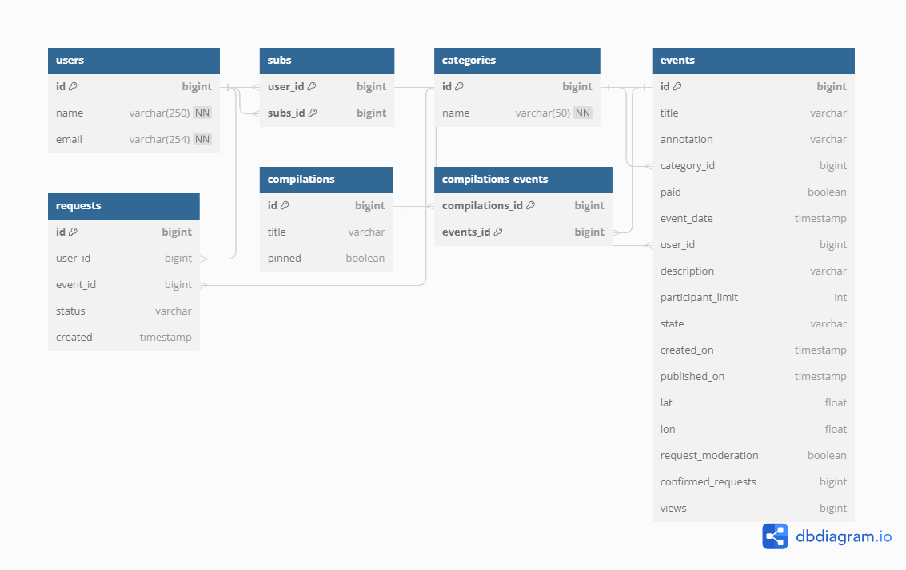

# Explore with me
Учебный проект Яндекс.Практикум

## Описание 
         

Сервис-афиша для размещения информации о событиях(от выставки до похода в кино), на котором пользователи могут находить компанию для участия в них.

## Структура

Сервис состоит из двух модулей:
1. [Основной сервис] — отвечает за обработку информации, которая связана с событиями.
    - Основной функционал
        * Public API - доступен без регистрации
            * просмотр событий и подборок событий
            * просмотр категорий
        * Private API - доступен только зарегистрированным пользователям
            * Добавление и редактирование события
            * Работа с запросами на участии в событие
            * Подача/отмена запроса на участие в событии
            * Просмотр информации о запросах на участие
            * Получение полной информации о событиях текущего пользователя
        * Admin API - доступен администратору сервиса
            * Добавление/изменение/удаление категорий
            * Добавление/удаление пользователей
            * Создание/редактирование/удаление подборок событий
            * Получение информации о пользователе
            * Обновление информации о событии
    - Дополнительный функционал
        * [Подписка на друзей]

2. [Сервис статистики] — хранит количество просмотров и позволяет делать различные выборки.

## Схема Базы Данных

